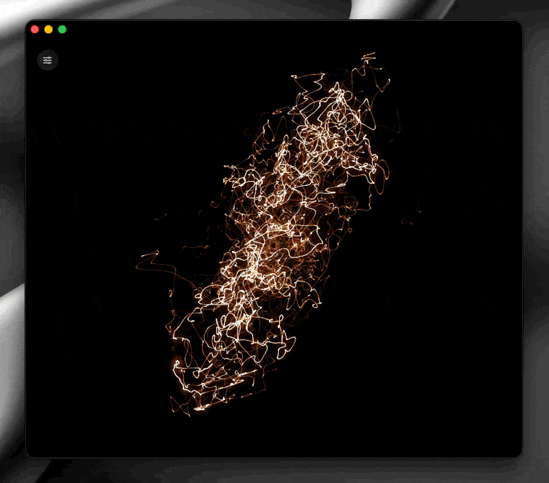

# Scope

A real-time music visualizer for macOS. It's an audio oscilloscope: you point it at
an app (or the whole system) and it draws the sound the way an old analog scope would.
The left channel goes on the X axis, the right channel on the Y axis, and a glowing
beam traces out the shape. It leaves trails and blooms like a real CRT.

It grabs the sound straight from the app using Core Audio's process taps, so you
don't need BlackHole or any loopback driver.



## What you need

- macOS 14.4 or newer (the tap API showed up in 14.2 but only really works from 14.4)
- a Mac that runs Metal, so basically any Mac from the last 10 years
- Xcode 16 or newer to build it

## Building

The Xcode project is already in the repo, so the easy way is:

```sh
open Scope.xcodeproj
```

and press Run. Or in the terminal:

```sh
xcodebuild -scheme Scope -configuration Release build
```

There's no signing team set up, it just signs locally ("Sign to Run Locally"), which
is fine for running it on your own Mac. The project is generated from `project.yml`
with [XcodeGen](https://github.com/yonaskolb/XcodeGen), so run `xcodegen generate` if
you move files around.

One heads up: on newer Xcode the Metal compiler is a separate download. If the build
complains about a missing Metal toolchain, run this once:

```sh
xcodebuild -downloadComponent MetalToolchain
```

## The permission thing

The first time it starts capturing, macOS asks for permission to record audio. That's
the system audio permission the tap API needs, and without it Scope can't read the
other app's sound. The text you see in the prompt comes from
`NSAudioCaptureUsageDescription` in `Info.plist`.

Scope doesn't save the audio anywhere, it only reads it to draw it. It also mutes the
audio it taps by default so the app itself stays quiet. If you actually want to hear
the source while you watch it, turn off the **Silent** switch. If you said no to the
prompt and nothing shows up, go to **System Settings > Privacy & Security**, allow it,
and start capture again.

## Using it

Pick a source from the menu (every app making sound is listed, plus
**System (all audio)**) and the beam starts moving. Press **H** to hide or show the
controls.

| Control | What it does |
|---|---|
| Source | which app to listen to, or everything |
| Silent | mutes the tapped audio so Scope makes no sound (on by default) |
| Beam colour | warm, green, amber or ice |
| Intensity | how bright the beam is |
| Glow | how much it blooms |
| Afterglow | how long the trail sticks around |
| Line width | how thick the beam is |
| Gain | scales the input by a fixed amount |
| Sensitivity | auto-levels the trace to the music's loudness, so quiet and loud tracks both fill the screen (0 turns it off) |
| Pitch spin | spins the figure based on the pitch (0 is off) |

Your settings get saved, so they're still there next time you open it.

### Adding a source

There's nothing to set up. Any app that plays audio shows up in the list on its own.
Just start playing something, hit the refresh button, and it's there.
**System (all audio)** taps everything at once.

## How it works

There are two parts and they run separately, only meeting at a lock-free ring buffer.

The **capture** side (`Scope/Audio`) makes a `CATapDescription` for the app you picked,
creates a tap with `AudioHardwareCreateProcessTap`, puts it inside a private aggregate
device, and reads float samples in a real-time callback. That callback doesn't allocate
memory or take locks, it just copies samples into the ring.

The **rendering** side (`Scope/Render`) is a small Metal pipeline that runs at the
screen's refresh rate, separate from the audio:

1. last frame's image fades out a little, which is the afterglow
2. the new samples get smoothed with Catmull-Rom and drawn as soft glowing line
   segments, brighter where the beam moves slowly, like a real CRT
3. a bright pass plus a blur make the bloom
4. a final pass colors the beam, blows the bright core out toward white, and adds a
   slight vignette

The look is based on the *s(o)scilloscope* plugin by MAarts. For the capture side I
leaned on Apple's "Capturing system audio with Core Audio taps" sample and Guilherme
Rambo's [AudioCap](https://github.com/insidegui/AudioCap), which is the clearest
example of the tap API around.

## License

MIT, see [LICENSE](LICENSE).
