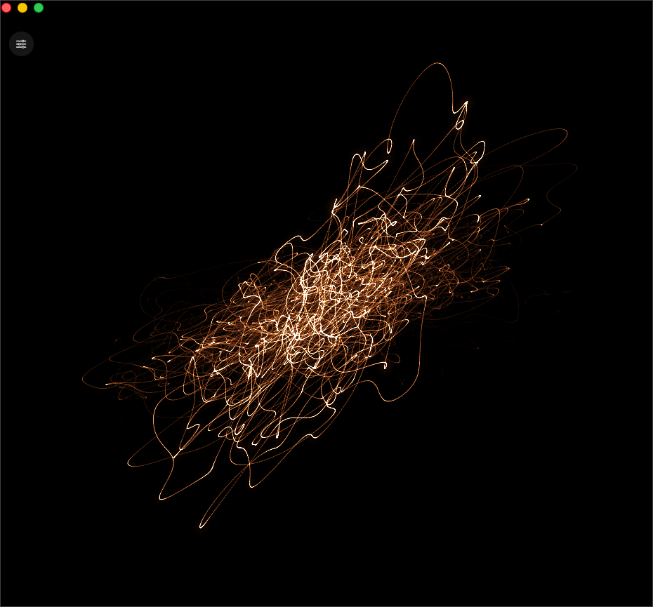

# Scope

A real-time vector oscilloscope for macOS. Point it at any running app — or the
whole system — and it draws the audio the way an analog scope would: left channel
on X, right channel on Y, traced by a glowing phosphor beam that lingers and blooms.

No loopback driver, no BlackHole, no virtual audio devices. Scope listens to a
process's output directly through Core Audio's process-tap API.



## Requirements

- macOS 14.4 or later — process taps technically arrived in 14.2, but they're only
  dependable from 14.4 on
- A Metal-capable Mac (anything from the last decade)
- Xcode 16 or later to build

## Building

The `.xcodeproj` is checked in, so the fastest path is just:

```sh
open Scope.xcodeproj
```

and hit Run. Or from the terminal:

```sh
xcodebuild -scheme Scope -configuration Release build
```

There's no signing team set — it builds ad-hoc ("Sign to Run Locally"), which is
all you need to run it on your own machine. The project is generated from
`project.yml` with [XcodeGen](https://github.com/yonaskolb/XcodeGen); run
`xcodegen generate` if you change the file layout.

> On recent Xcode the Metal compiler is a separate download. If the build stops on
> a missing Metal toolchain, run `xcodebuild -downloadComponent MetalToolchain` once.

## The permission it needs

The first time Scope starts capturing, macOS shows its audio-recording consent
prompt. That's the system-audio TCC permission that backs the process-tap API —
without it Scope can't read another app's output. The prompt's wording lives in
`Info.plist` under `NSAudioCaptureUsageDescription`.

Scope never writes the audio anywhere; it only reads frames to draw them. By
default it also *mutes* the tapped output so the app itself stays silent — flip
the **Silent** switch off if you'd rather hear the source while you watch it. If
you dismiss the prompt and nothing shows up, grant it under
**System Settings → Privacy & Security** and start capture again.

## Using it

Choose a source from the menu — every app currently making sound is listed, along
with **System (all audio)** — and the beam comes alive. Press **H** to show or
hide the controls.

| Control      | What it does                                              |
|--------------|-----------------------------------------------------------|
| Source       | Which app to listen to, or the whole system               |
| Silent       | Mute the tapped audio so Scope makes no sound (on)        |
| Beam colour  | Warm, green, amber or ice phosphor                        |
| Intensity    | Beam brightness                                           |
| Glow         | Bloom amount                                              |
| Afterglow    | How long the trail takes to fade                          |
| Line width   | Beam thickness                                            |
| Gain         | Input scaling                                             |
| Pitch spin   | Rotate the figure by the detected pitch (0 turns it off)  |

Settings persist between launches.

### Adding a source

There's nothing to register. Any process that opens an audio output appears in the
picker on its own — start playback in the app, hit refresh, and it's there.
**System (all audio)** taps everything mixed together.

## How it works

The two halves run on their own clocks and only meet at a lock-free ring buffer.

**Capture** (`Scope/Audio`) builds a `CATapDescription` for the chosen process,
creates a tap with `AudioHardwareCreateProcessTap`, wraps it in a private aggregate
device, and pulls float samples from a real-time IO callback. That callback does no
allocation and takes no locks — it just copies frames into the ring.

**Rendering** (`Scope/Render`) is a small Metal pipeline running at the display's
refresh rate, independent of the audio clock:

1. last frame's accumulation texture is faded by an exponential decay — the afterglow;
2. the new samples are upsampled with Catmull-Rom and drawn as soft, additively
   blended line quads, brighter where the beam moves slowly, the way a real CRT
   dwells on slow-moving traces;
3. a bright-pass and separable Gaussian build the bloom;
4. a final pass tints the beam, tone-maps the overexposed core toward white, and
   adds a faint vignette.

The look is modelled on MAarts' *s(o)scilloscope*. The capture layer follows
Apple's "Capturing system audio with Core Audio taps" sample and Guilherme Rambo's
[AudioCap](https://github.com/insidegui/AudioCap), which is the clearest reference
for the tap API out there.

## License

MIT — see [LICENSE](LICENSE).
